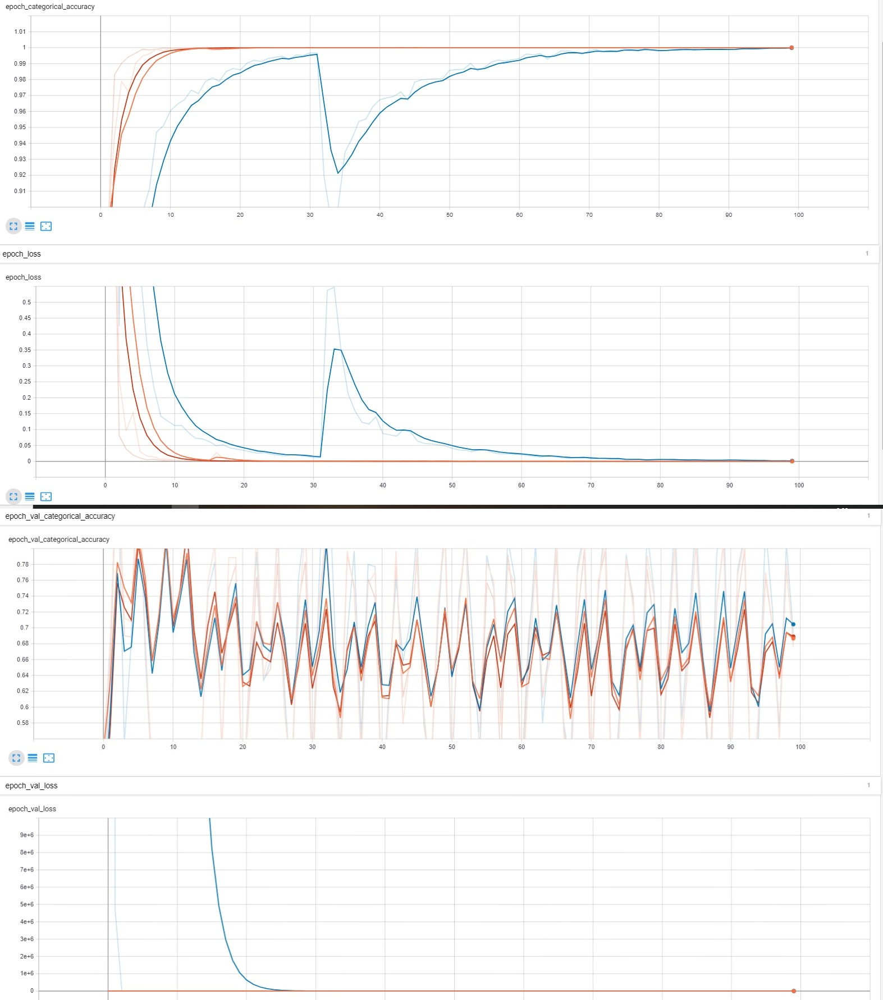
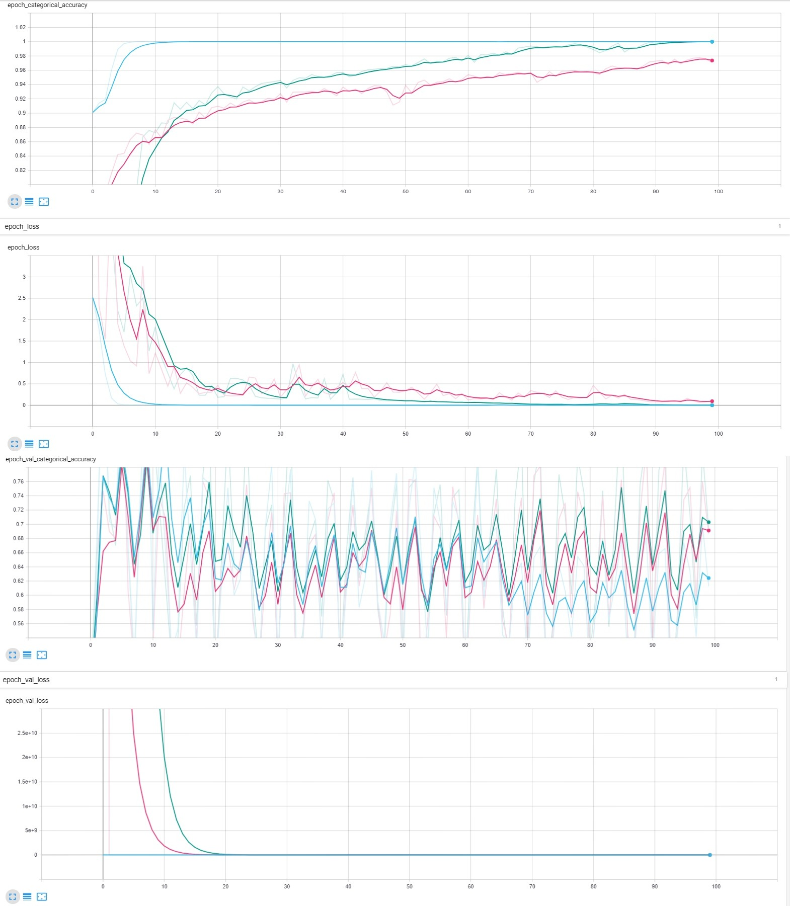
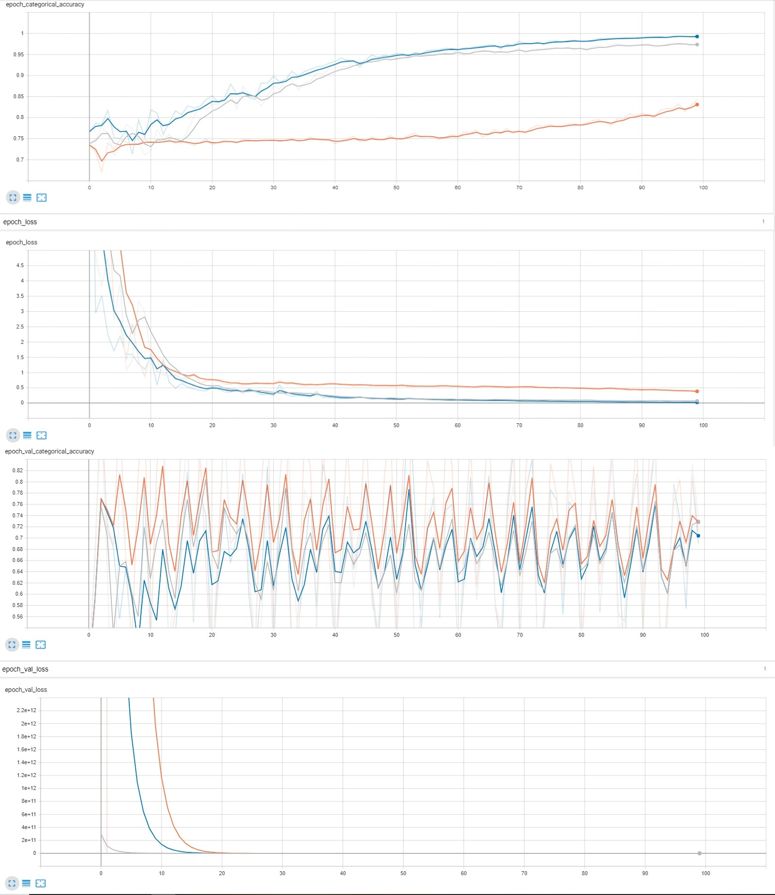
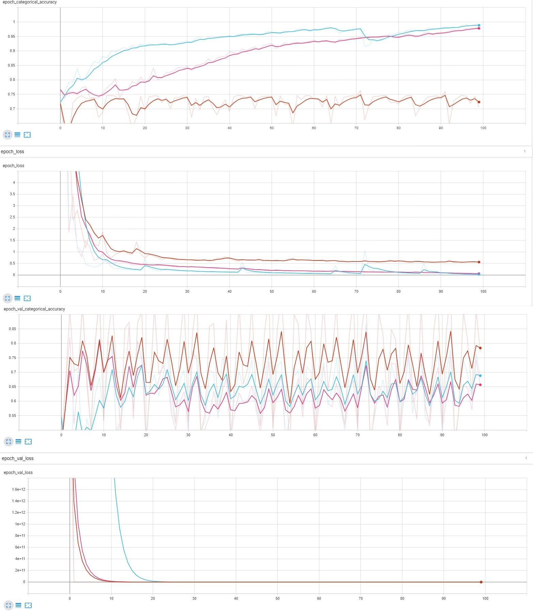
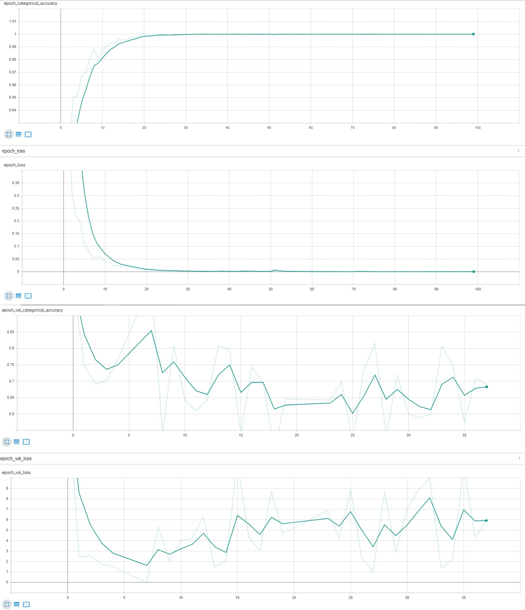

# Lab4
## 1 этап: горизонтальное отражение
На графиках ниже представлены: 
Оранжевый - lr = 0.001; Синий - lr = 0.005; Красный - lr = 0.0001.
Красный и оранжевый ведут себя практически одинаково, сойдясь по точности на обучающей выборке уже приблизительно к 15 эпохе. Ошибка так же у обоих сошлась примерно к 15 эпохе. В это же время синий демонстрирует большой выброс как на ошибке, так и на точности на обучающей выборке, тем не менее под конец обучения практически сходится. На валидационной выборке по точности все три графика демонстрируют схожее поведение, однако у красного самый маленький разброс. 
Оптимальным вариантом является красный с lr = 0.0001, ввиду меньшего разбросав ошибки на валидационной выборке, несмотря на схожесть поведения с оранжевым на всех графиках. Что касается максимально возможного темпа обучения: судя по поведению синего, проявляющего нестабильность на фоне остальных, максимальным темпом обучения было бы значение приблизительно равное 0.01

## 2 этап: поворот на случайный угол
На графиках ниже представлены:
Голубой - поворот на 90 с lr = 0.001; Розовый - поворот на 45 с lr = 0.01; Зелёный - поворот на 60 с lr = 0.01.
По графикам видим, что розовый способен обучиться, но для этого ему нужно больше эпох. Зелёный в самом конце обучения достигает максимального значения по точности на обучающей выборке, однако на 78 эпохе имеет выброс, помешавший ему сойтись раньше, ошибка у него сходится тоже в самом конце. В это же время голубой демонстрирует быстрое схождение (примерно на 13-14 эпохах) по точности, такое же быстрое схождение ошибки на обучающей выборке. На валидационной выборке небольшой разброс по ошибке имеет только голубой.
В случае этих трёх исследований, голубой - явный победитель, он и будет оптимальным вариантом(поворот на 90 с lr = 0.001). Что касается максимального темпа обучения: вероятно, судя по трём проведенным опытам, lr = 0.01 будет максимальным, но необходимо больше эпох.

## 3 этап: изменение яркости и контраста
На графиках ниже представлены:
Серый - яркость с max_delta = 0.03, контрастность с коэффициентом 0.4-1.1, lr = 0.01; 
Оранжевый - яркость с max_delta = 0.05, контрастность с коэффициентом 0.5-1.3, lr = 0.01;
Синий - яркость с max_delta = 0.08, контрастность с коэффициентом 0.6-1.4, lr = 0.01.
Оранжевый на обучающей выборке до 70й эпохи сходился очень медленно на фоне остальных, однако после 70й скорость его схождения по точности возросла. На валидационной выборке имеют схожие по поведению графики точности, однако синий имеет меньшие пики. На обучающей выборке синий и серый ведут себя похоже, но синий сходится быстрее. Среди трёх явно выделяется оранжевый, демонстрируя худший результат. 
Оптимальный вариант в данном случае из трёх полученных - с яркостью с max_delta = 0.08, контрастностью с коэффициентом 0.6-1.4 и lr = 0.01.

## 4 этап: использование случайного участка изображения
На графиках ниже представлены:
Коричневый - вырез 75х75 из 224х225, lr = 0.01; Голубой - центральное приближение на 0.7, lr = 0.01; Розовый - центральное приближение на 0.4, lr = 0.01.
На обучающей выборке коричневый не показывает нормального результата, даже не стремясь к схождению. Синий же сошёлся быстрее всех, мог бы и быстрее, если бы не выброс по точности на 75 эпохе. Так же имеет выделяющиеся пики по ошибке. В целом розовый ведёт себя более стабильно, чем остальные, не имея больших пиков и выбросов на обучащех выборке, однако сходится чуть медленне синего. Несмотря на выбросы, наверное, оптимальным вариантом будет синий - центральное приближение на 0.7 и lr = 0.01, что примерно рядом с максимально возможным.

## 5 этап: совместное применение техник аугментации данных с оптимальными параметрами
На графике ниже представлен бирюзовый - смесь оптимальных вариантов аугментации данных различными способами с lr = 0.001.
На обучающей выборке видим достаточном стабильное поведение, быстрое схождение, но на ошибке на 52 эпохе есть небольшой выброс.
На валидационной выборке скачки по точности в пределах 0.85-0.6, останавливается на 37 эпохе.

